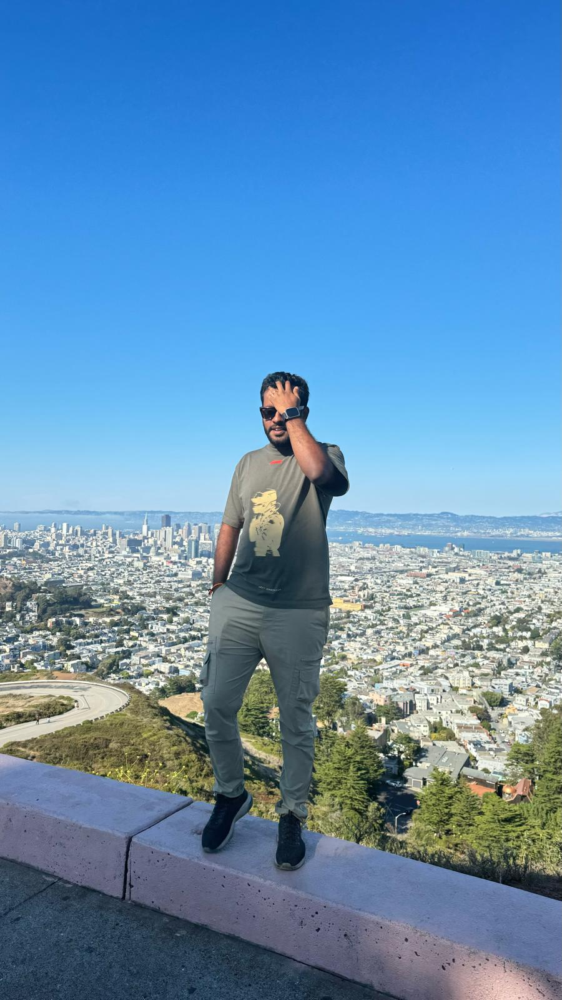

# Vamsikrishna_Ala

Hello from the world of data! I'm Vamsikrishna Ala, a passionate Data Engineer with 2 years of experience in managing and processing large-scale data systems. I'm currently deepening my knowledge in Business Analytics & Information Systems at the University of South Florida.

When I step away from my computer, I love to challenge myself with new learning experiences. In my free time, I enjoy exploring new books, honing my skills in strategic chess, and experimenting with ambidextrous writing.
<!--

-->
